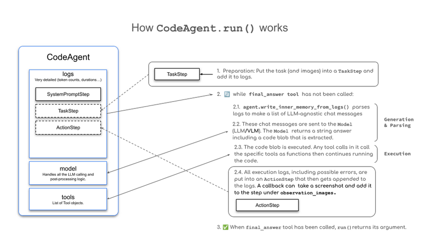

# LLMs

- An LLM is a type of AI model that excels at understanding and generating human language. They are trained on vast amounts of text data, allowing them to learn patterns, structure and even nuance in language. These models typically consist of many millions of parameters.

- Most LLMs nowadays are built on the Transformer architecture - a deep learning architecture based on the "Attention" algorithm.

- Three types of transformers

1. _Encoders_:

    - An encoder-based transformer takes text(or other data) as an input and outputs a dense representation(or embedding) of that text.

    * Eg: BERT
    * Use cases: Text classification, semantic search, NER
    * Typical size: Millions of parameters

2. _Decoders_:
    - A decoder-based tranformer focuses on generating new tokens to complete a sequence, one token at a time.

    * Eg: Llama 
    * Use cases: Text generation,chatbots,code generation
    * Typical size: Billions of parameters.

_3. Seq2Seq(Encoder-decoder)_:

    - A sequence-to-sequence transformer combines an encoder and a decoder. The encoder first processes the input sequence into a context representation, then the decoder generates an output sequence.

    * Eg: T5, BART
    * Use cases: Translation, Summarization, Paraphrasing
    * Typical Size: Millions of parameters.

* Underlying principle: Objective is to predict the next token, given a sequence of previous tokens.

* A token is the unit of information an LLM works with. 

* Each LLM has some special tokens specific to the model. The LLM uses these tokens to open and close the structured components of its generation.

* The most important of those is the End of sequence token.

[tokens]](image-1.png)

## Next token prediction

- LLMs are said to be _autoregressive_, meaning that the output from one pass becomes the input of the next one.

- The loop continues until the model predicts the next token to be the EOS token.

* Once the input is tokenized, the model computes a representation of the sequence that captures information about the meaning and the position of each token in the input sequence.

* This representation goes into the model, which outputs scores that rank the likelihood of each token in its vocabulary as being the next one in the sequence.

- Based on these scores , we have multiple strategies to select the tokens to complete the sentence.

* The easiest decoding strateggy would be to always take the token with the maximum score.

* Advanced strategy => _Beam Search_: explores the multiple candidate sequences to find the one with the maximum total score-even if some individual tokens have lower scores.

- Context length: refers to the maximum number of tokens the LLM can process and the maximum attention span it has.

- Prompt : Input sequence we provide to an LLM is known as a Prompt.

## How are LLMs are trained:

- LLMs are trained on large datasets of text, where they learn to predict the next word in a sequence through a self-supervised or masked language modeling objective.

- From this unsupervised learning, the model learns the structure of the language and underlying patterns in text, allowing the model to generalize to unseen data.

- After this initial pre-trainig, LLMs can be fine-tuned on a supervised learning objective to perform specific tasks. 

- For example, some models are trained for conversational structures or tool usage, while others focus on classifiction or code generation.

