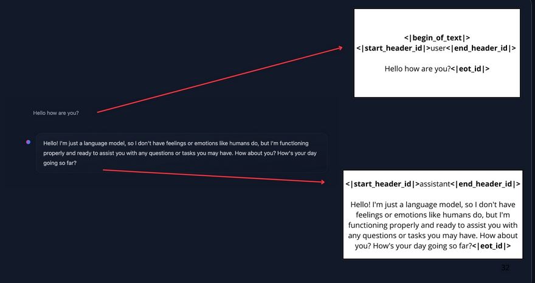

# Messages and special tokens

## Chat templates:

- They act as bridge between conversational messages(user and assistant turns) and the specific formatting requirements for the chosen LLM.

- Chat templates structure the communication between the user and the agent, ensuring that every model- despite its unique special tokens- recieves the correctly formatted prompt.

## System Messages

- Also called system prompts define how the model should behave. They serve as persistent instructions, guiding every subsequent interaction.

- System message also gives information about the available tools, provides instructions to the model on how to format the actions to take,and includes guidelines on how the thought process should be segmented.

## Conversation: User and Assistant Messages

- A conversation consists of alternating messages between a Human(user) and an LLM(assistant).

- Chat template maintains context by preserving chat history, storing previous exchanges between the user and the assistant. 

## Chat Templates

### Base models vs Instruct models

* A base model is trained on raw text data to predict the new token.

* An instruct model is fine-tuned specifically to follow instructions and engage in conversations.

- To make a Base model behave like an instruct model, we need to format our prompts in a consistent way that the model can understand.

    - ChatML is a template format that structures conversations with clear role indicators. 

[*jinja2 code*](https://jinja.palletsprojects.com/en/stable/)

- This structure helps maintain consistency accross interactions and ensures the model responds appropriately to different types of inputs.

