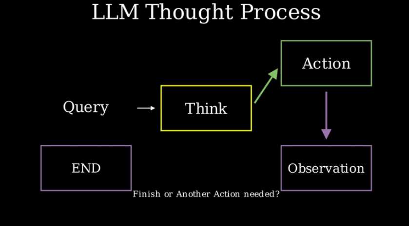
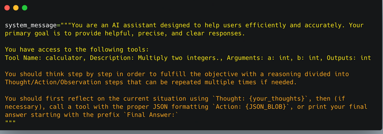

# Understanding AI agents through the Thought-Action-Observation Cycle

## The core components:
- Agents work in a continuous cycle of: *thinking(Thought)-> acting(Act) and observing(Observe).*

1. Thought: The LLM part of the Agrnt decides what the next step should be.

2. Action: the agent takes an action, by calling the tools with the associated arguments.

3. Observation: The model reflects on the response from the tool.

## The Thought-Action-Observation Cycle

- the three components work together in a continuous loop. The agent uses a while loop: the loop continues until the objective of the agent has been fulfilled.

- In many Agent frameworks, the rules and guidelines are embedded directly into the system prompt, ensuring thtat every cycle adheres to a defined logic.

- The system message has:
    * The Agent's behaviour
    * The tools our agent has access to, as we described in the previous section.
    * The Thought-Action-Observation Cycle, that we bake into the LLM instructions.

- Agents iterate through  loop until the objective is fulfilled:

    - Alfred's process is cyclical.
        - It starts with a thought,then acts by calling a tool and finally oserves the outcome. If the observation had indicated an error or incomplete data, the agent could have re-entered the cycle to its approach.
    - Tool integration:
        - The ability to call a tool enables the agent to go beyond the static knowledge and retrieve real-time data, an essential aspect of many AI agents.

    - Dynamic Adaptation:
        - Each cycle allows the agent to incorporate fresh information into its reasoning, ensuring that the final answer is well-informed and accurate.

* ReAct cycle: interplay of thought,action and observation empowers AI agents to solve complex tasks iteratively.

* By applying these principles, we can design agents that not only reaon about their tasks but also effectively utilize external tools to complete them, all while continuously refining their output based on environmental feedback.