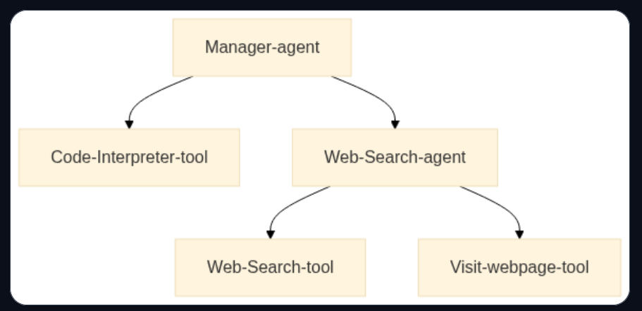

# Multi-Agent Systems
- They enable specialized agents to collaborate on complex tasks, improving modularity,scalability and robustness. Instead of relying on a single agent, tasks are distributed among agents with distinct capabilities.
- In smolagents, different agents can be combined to generate Python code, call external tools, perform web searches and more. 

- A manager agent for task delegation.
- A code interpreter agent for code execution
- A web search agent for information retrieval

## Multi-Agent systems in action
- A multi agent system consists of multiple specialized agents working together under the coordination of an *Orchestrator Agent*. This approach enables complex workflows by distributing tasks among agents with distinct roles.

- A multi-agent RAG system can integrate:
    - A web agent for browsing the internet.
    - A retriever agent for frtching information from knowledge bases.
    - An image generation agent for producing visuals.
