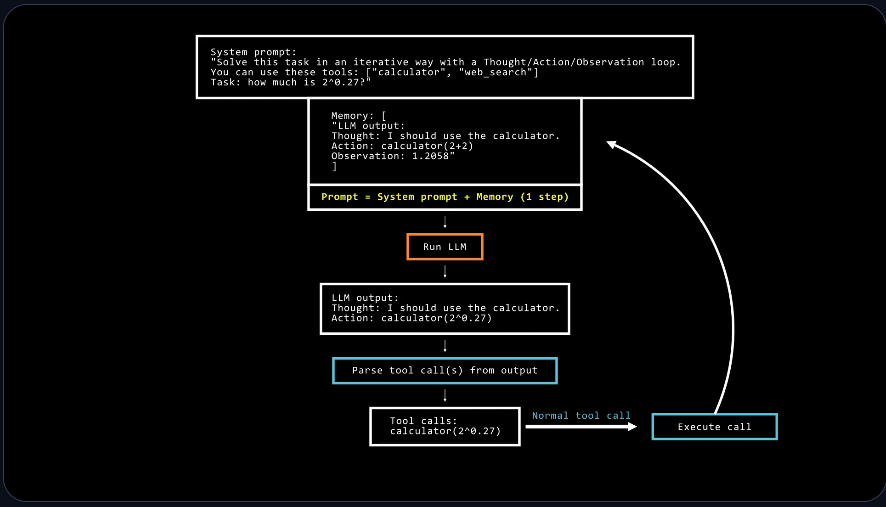

# TOOLS

- Tools allow agents to take actions.

- A tool is a function given to the LLM. This function should fulfill a clear objective.

    * Web search: allows the agent to fetch up-to-date info from the internet.

    * Image generation: Creates images based on text descriptions.

    * Retrieval: Retrieves information from an external source.

    * API Interface: Interacts with an external API.

- LLMs predict the completion of a prompt based on their training data, which means their internal knowledge only includes events prior to their training.

- To keep it updated, we must provide it some tool.

* A tool should contain:
    - A text description of what the function does.
    - A callable(something to perform an action).
    - Arguments with typings.
    - (Optional) Outputs with typing.

## Working of tools:

- LLMs can only recieve text inputs and generate text outputs. They can't call tools on their own.

- Providing tools to an agent means that the LLM now knows about the existence of these tools and instructing it to generate text-based invocations when needed.

- The agent reads this response, identifies the tool call is required,executes the tool on the LLMs behalf, and retrieves the actual data.

- The LLM then processes this additional context and generates a natural-sounding response for the user.

## How we provide tools to an LLM

- We use the system prompt to provide textual descriptions of available tools to the model:

- We need to be very precise and accurate about: 
    - What the tool does
    - What exact inputs it expects

- When we pass the previous string as part of the input to the LLM, the model will recognise it as a tool, and will know what it needs to pass as inputs and what to expect from the output.

- Use _@tool_ decorator before the function definiton to indicate a tool.

# MODEL CONTEXT PROTOCOL: a unified tool interface

- It is an open protocol that standardizes how applications provide tools to LLMs.MCP provides:

    - A growing list of pre-built integrations that your LLM can directly plug into.
    - The flexibility to switch between LLM providers and vendors.
    - Best practices for securing your data within your infrastructure.

- To interact with a tool, the LLM needs an interface description with these key components:
    - Name: What the tool is called
    - Tool description: What the tool does
    - Input types and descriptions: What arguments the tool accepts
    - Output type: what the tool returns

- 

## Tool creation methods

1. Using the @tool decorator for simple function-based tools
2. Creating a subclass of Tool for more complex functionality.

### The @tool decorator

- Smolagents will parse basic information about the function from Python. 

- We define the function with:
    - A clear and descriptive function name that helps the LLM understand its purpose
    - Type hints for both inputs and outputs to ensure proper usage.
    - A detailed description, including an Args: section where each argument is explicitly described. These descriptions provide valuable context for the LLM, so it's important to write them carefully.

    